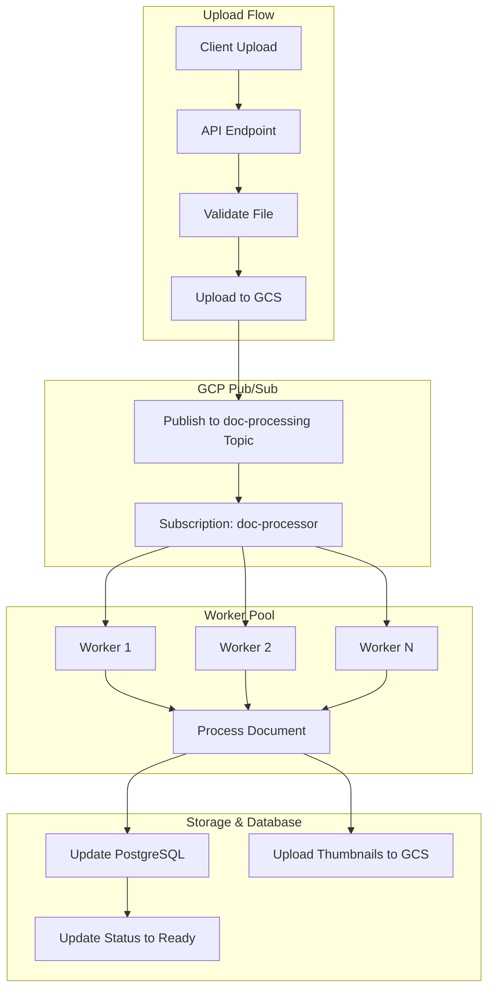
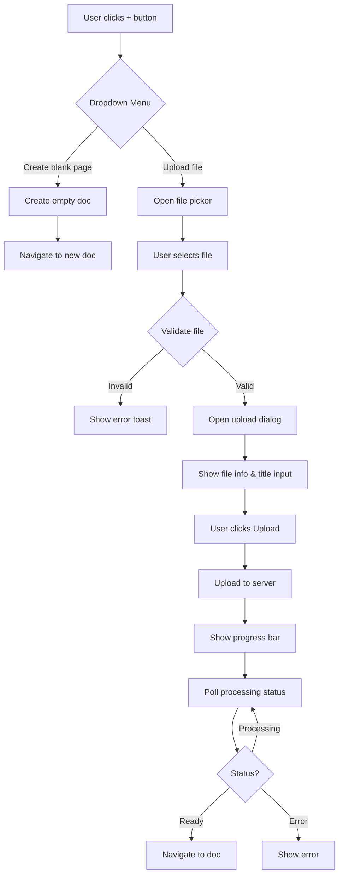

# Document Upload Architecture - Addendum
## GCP Pub/Sub Integration & UI Specifications

**Date:** 2026-01-29  
**Status:** Architecture Update  
**Changes:** Replace BullMQ+Redis with GCP Pub/Sub, Add UI specifications

---

## 1. Job Queue: GCP Pub/Sub Instead of BullMQ+Redis

### Rationale

**Advantages of GCP Pub/Sub:**
- ✅ Already integrated in the project ([`server/services/pubsub-events.ts`](../server/services/pubsub-events.ts:1))
- ✅ Fully managed service (no Redis infrastructure needed)
- ✅ Better integration with GCP ecosystem
- ✅ Automatic scaling and high availability
- ✅ Built-in dead letter queues
- ✅ Lower operational overhead
- ✅ Cost-effective for variable workloads

**Cost Comparison:**
- **Redis (managed):** $20-50/month + maintenance
- **GCP Pub/Sub:** $0.40 per million operations (estimated $10-20/month)

### Architecture Changes

#### Updated Processing Pipeline



### Implementation

#### 1. Pub/Sub Topic Setup

```typescript
// server/services/document-pubsub.ts

import { PubSub } from '@google-cloud/pubsub';
import { readFileSync, existsSync } from 'fs';
import { join, dirname } from 'path';
import { fileURLToPath } from 'url';

const __filename = fileURLToPath(import.meta.url);
const __dirname = dirname(__filename);

let pubsubClient: PubSub | null = null;
let documentProcessingTopic: any = null;

// Get project ID from credentials
function getProjectId(): string {
  const serviceAccountPath = join(__dirname, '../../gcp_credential.json');
  if (existsSync(serviceAccountPath)) {
    const serviceAccount = JSON.parse(readFileSync(serviceAccountPath, 'utf8'));
    return serviceAccount.project_id;
  }
  return process.env.GOOGLE_CLOUD_PROJECT || process.env.GCP_PROJECT_ID || '';
}

// Initialize Pub/Sub client
function getPubSubClient(): PubSub {
  if (!pubsubClient) {
    const projectId = getProjectId();
    const serviceAccountPath = join(__dirname, '../../gcp_credential.json');
    if (existsSync(serviceAccountPath)) {
      pubsubClient = new PubSub({
        projectId,
        keyFilename: serviceAccountPath,
      });
    } else {
      // Use default credentials (for GKE with Workload Identity)
      pubsubClient = new PubSub({ projectId });
    }
  }
  return pubsubClient;
}

// Get or create document-processing topic
async function getDocumentProcessingTopic() {
  if (!documentProcessingTopic) {
    const pubsub = getPubSubClient();
    const topicName = process.env.PUBSUB_DOC_PROCESSING_TOPIC || 'document-processing';
    documentProcessingTopic = pubsub.topic(topicName);
    
    // Check if topic exists, create if not
    const [exists] = await documentProcessingTopic.exists();
    if (!exists) {
      console.warn(`⚠️ Pub/Sub topic ${topicName} does not exist. Creating...`);
      await pubsub.createTopic(topicName);
      documentProcessingTopic = pubsub.topic(topicName);
    }
  }
  return documentProcessingTopic;
}

/**
 * Publish a document processing job to Pub/Sub
 */
export async function publishDocumentProcessingJob(data: {
  docId: string;
  orgSlug: string;
  storagePath: string;
  mimeType: string;
  fileSize: number;
  fileName: string;
  ownerEmail: string;
}): Promise<string> {
  try {
    const topic = await getDocumentProcessingTopic();
    const message = {
      jobType: 'document_processing',
      ...data,
      timestamp: Date.now(),
      retryCount: 0,
    };

    const messageId = await topic.publishMessage({
      json: message,
      attributes: {
        docId: data.docId,
        mimeType: data.mimeType,
        orgSlug: data.orgSlug,
      },
    });

    console.log(`📤 Published document processing job to Pub/Sub: ${data.docId} (messageId: ${messageId})`);
    return messageId;
  } catch (error: any) {
    console.error(`❌ Error publishing document processing job to Pub/Sub:`, error);
    throw error;
  }
}

/**
 * Publish a status update event
 */
export async function publishDocumentStatusUpdate(data: {
  docId: string;
  status: 'processing' | 'ready' | 'error';
  progress?: number;
  error?: string;
}): Promise<void> {
  try {
    const topic = await getDocumentProcessingTopic();
    const message = {
      jobType: 'status_update',
      ...data,
      timestamp: Date.now(),
    };

    await topic.publishMessage({
      json: message,
      attributes: {
        docId: data.docId,
        status: data.status,
      },
    });

    console.log(`📤 Published status update for doc ${data.docId}: ${data.status}`);
  } catch (error: any) {
    console.error(`❌ Error publishing status update:`, error);
    // Don't throw - status updates are non-critical
  }
}
```

#### 2. Pub/Sub Subscription Worker

```typescript
// server/workers/document-processor-worker.ts

import { PubSub, Message } from '@google-cloud/pubsub';
import { DocumentProcessorFactory } from '../services/document-processor.js';
import { publishDocumentStatusUpdate } from '../services/document-pubsub.js';
import { updateDocContent, updateDocProcessingStatus } from '../database/queries.js';
import { downloadFromGCS, uploadToGCS } from '../utils/storage.js';

const pubsub = new PubSub();
const subscriptionName = process.env.PUBSUB_DOC_PROCESSING_SUBSCRIPTION || 'document-processing-sub';
const subscription = pubsub.subscription(subscriptionName);

const processorFactory = new DocumentProcessorFactory();

// Configure subscription settings
subscription.setOptions({
  flowControl: {
    maxMessages: 5, // Process 5 messages concurrently
    allowExcessMessages: false,
  },
  ackDeadline: 600, // 10 minutes to process (for large files)
});

/**
 * Process a document processing job
 */
async function processDocumentJob(message: Message) {
  const data = message.data ? JSON.parse(message.data.toString()) : message.attributes;
  const { docId, orgSlug, storagePath, mimeType, fileSize, fileName, ownerEmail } = data;
  
  console.log(`📄 Processing document: ${docId} (${fileName})`);
  
  try {
    // Update status to processing
    await updateDocProcessingStatus(docId, 'processing');
    await publishDocumentStatusUpdate({ docId, status: 'processing', progress: 0 });
    
    // Download file from GCS
    console.log(`⬇️ Downloading file from GCS: ${storagePath}`);
    const fileBuffer = await downloadFromGCS(storagePath);
    await publishDocumentStatusUpdate({ docId, status: 'processing', progress: 25 });
    
    // Get appropriate processor
    const processor = processorFactory.getProcessor(mimeType);
    if (!processor) {
      throw new Error(`No processor found for MIME type: ${mimeType}`);
    }
    
    // Process document
    console.log(`🔄 Extracting content from ${fileName}...`);
    const result = await processor.process(fileBuffer, { mimeType, fileSize, fileName });
    await publishDocumentStatusUpdate({ docId, status: 'processing', progress: 50 });
    
    // Generate thumbnails
    console.log(`🖼️ Generating thumbnails for ${fileName}...`);
    const thumbnails = await processor.generateThumbnails(fileBuffer);
    
    // Upload thumbnails to GCS
    const thumbnailUrls = await Promise.all(
      thumbnails.map((thumbnail, index) => 
        uploadToGCS(thumbnail, `orgs/${orgSlug}/doc-thumbnails/${docId}/page-${index + 1}.jpg`)
      )
    );
    
    // Add thumbnail URLs to content
    result.content.thumbnails = thumbnailUrls;
    await publishDocumentStatusUpdate({ docId, status: 'processing', progress: 75 });
    
    // Update database with processed content
    console.log(`💾 Updating database for ${docId}...`);
    await updateDocContent(docId, result.content, result.extractedText);
    await publishDocumentStatusUpdate({ docId, status: 'processing', progress: 90 });
    
    // Update status to ready
    await updateDocProcessingStatus(docId, 'ready');
    await publishDocumentStatusUpdate({ docId, status: 'ready', progress: 100 });
    
    console.log(`✅ Successfully processed document: ${docId}`);
    
    // Acknowledge the message
    message.ack();
  } catch (error: any) {
    console.error(`❌ Error processing document ${docId}:`, error);
    
    // Update status to error
    await updateDocProcessingStatus(docId, 'error', error.message);
    await publishDocumentStatusUpdate({ 
      docId, 
      status: 'error', 
      error: error.message 
    });
    
    // Check retry count
    const retryCount = data.retryCount || 0;
    const maxRetries = 3;
    
    if (retryCount < maxRetries) {
      // Nack the message to retry
      console.log(`🔄 Retrying document processing (attempt ${retryCount + 1}/${maxRetries})`);
      message.nack();
    } else {
      // Max retries reached, acknowledge to remove from queue
      console.error(`❌ Max retries reached for document ${docId}, giving up`);
      message.ack();
    }
  }
}

/**
 * Start the document processing worker
 */
export function startDocumentProcessingWorker() {
  console.log('🚀 Starting document processing worker...');
  console.log(`📡 Listening to subscription: ${subscriptionName}`);
  
  // Listen for messages
  subscription.on('message', processDocumentJob);
  
  // Handle errors
  subscription.on('error', (error) => {
    console.error('❌ Subscription error:', error);
  });
  
  // Handle close
  subscription.on('close', () => {
    console.log('🔌 Subscription closed');
  });
  
  console.log('✅ Document processing worker started');
}

/**
 * Stop the document processing worker
 */
export async function stopDocumentProcessingWorker() {
  console.log('🛑 Stopping document processing worker...');
  await subscription.close();
  console.log('✅ Document processing worker stopped');
}
```

#### 3. Environment Variables

Add to `.env`:

```bash
# GCP Pub/Sub
PUBSUB_DOC_PROCESSING_TOPIC=document-processing
PUBSUB_DOC_PROCESSING_SUBSCRIPTION=document-processing-sub
GOOGLE_CLOUD_PROJECT=leanworks-474204

# Processing settings
DOC_PROCESSING_MAX_RETRIES=3
DOC_PROCESSING_ACK_DEADLINE=600  # 10 minutes
DOC_PROCESSING_CONCURRENCY=5
```

#### 4. Setup Script

```bash
# scripts/setup-document-processing-pubsub.sh

#!/bin/bash

PROJECT_ID="leanworks-474204"
TOPIC_NAME="document-processing"
SUBSCRIPTION_NAME="document-processing-sub"

echo "Setting up Pub/Sub for document processing..."

# Create topic
gcloud pubsub topics create $TOPIC_NAME \
  --project=$PROJECT_ID \
  --message-retention-duration=7d

# Create subscription with dead letter queue
gcloud pubsub subscriptions create $SUBSCRIPTION_NAME \
  --topic=$TOPIC_NAME \
  --project=$PROJECT_ID \
  --ack-deadline=600 \
  --message-retention-duration=7d \
  --max-delivery-attempts=3 \
  --enable-message-ordering

echo "✅ Pub/Sub setup complete"
```

### Updated Dependencies

**Remove:**
- ~~bullmq~~
- ~~ioredis~~

**Keep:**
- @google-cloud/pubsub (already installed)

### Updated Cost Estimate

**Before (BullMQ + Redis):**
- Redis: $20-50/month
- **Total:** $220-450/month

**After (GCP Pub/Sub):**
- Pub/Sub: $10-20/month (estimated 25-50M operations/month)
- **Total:** $210-420/month

**Savings:** $10-30/month + reduced operational overhead

---

## 2. UI Specification: '+' Button Menu

### Current Behavior
- Clicking '+' button immediately creates a blank document

### New Behavior
- Clicking '+' button shows a dropdown menu with two options:
  1. "Create a blank page"
  2. "Upload a file"

### Implementation

#### Updated DocsList Component

```typescript
// src/components/DocsList.tsx

import { Button } from "@/components/ui/button";
import {
  DropdownMenu,
  DropdownMenuContent,
  DropdownMenuItem,
  DropdownMenuTrigger,
} from "@/components/ui/dropdown-menu";
import { Plus, FileText, Upload } from "lucide-react";
import { useState, useRef } from "react";

export function DocsList({ variant = "sidebar" }: DocsListProps) {
  const [isUploadDialogOpen, setIsUploadDialogOpen] = useState(false);
  const fileInputRef = useRef<HTMLInputElement>(null);
  
  // ... existing code ...

  const handleCreateBlankDoc = async () => {
    trackClick('create_blank_doc', '/docs');
    
    if (!user?.email) {
      toast({
        title: "Error",
        description: "You must be logged in to create a document",
        variant: "destructive",
      });
      return;
    }

    try {
      const emptyTipTapContent = JSON.stringify({ 
        type: 'doc', 
        content: [{ type: 'paragraph' }] 
      });
      
      const newDoc: Doc = {
        id: uuidv4(),
        title: "Untitled",
        content: emptyTipTapContent,
        ownerEmail: user.email,
        projectId: null,
        teamId: null,
        visibility: 'all_members',
        visibleToMembers: [],
        metadata: { files: [] },
        createdAt: new Date().toISOString(),
        updatedAt: new Date().toISOString(),
      };

      const createdDoc = await createDoc.mutateAsync(newDoc);
      navigate(`/docs/${createdDoc.id}`);
    } catch (error) {
      toast({
        title: "Error",
        description: error instanceof Error ? error.message : "Failed to create document",
        variant: "destructive",
      });
    }
  };

  const handleUploadFile = () => {
    trackClick('upload_file_click', '/docs');
    fileInputRef.current?.click();
  };

  const handleFileSelected = async (event: React.ChangeEvent<HTMLInputElement>) => {
    const file = event.target.files?.[0];
    if (!file) return;

    trackClick('file_selected', '/docs', { 
      fileType: file.type, 
      fileSize: file.size 
    });

    // Validate file type
    const allowedTypes = [
      'application/pdf',
      'application/vnd.openxmlformats-officedocument.wordprocessingml.document',
      'application/vnd.openxmlformats-officedocument.presentationml.presentation',
      'application/vnd.openxmlformats-officedocument.spreadsheetml.sheet',
    ];

    if (!allowedTypes.includes(file.type)) {
      toast({
        title: "Invalid file type",
        description: "Please upload a PDF, Word, PowerPoint, or Excel file",
        variant: "destructive",
      });
      return;
    }

    // Validate file size (50MB max)
    if (file.size > 50 * 1024 * 1024) {
      toast({
        title: "File too large",
        description: "File size must be less than 50MB",
        variant: "destructive",
      });
      return;
    }

    // Show upload dialog
    setIsUploadDialogOpen(true);
    
    // Upload will be handled by DocumentUploadDialog component
  };

  return (
    <div className={cn(
      "flex flex-col h-full",
      variant === "sidebar" ? "p-4" : "p-6"
    )}>
      {/* Header with + button */}
      <div className="flex items-center justify-between mb-4">
        <h2 className="text-lg font-semibold">Documents</h2>
        
        <DropdownMenu>
          <DropdownMenuTrigger asChild>
            <Button size="sm" variant="ghost">
              <Plus className="h-4 w-4" />
            </Button>
          </DropdownMenuTrigger>
          <DropdownMenuContent align="end">
            <DropdownMenuItem onClick={handleCreateBlankDoc}>
              <FileText className="mr-2 h-4 w-4" />
              Create a blank page
            </DropdownMenuItem>
            <DropdownMenuItem onClick={handleUploadFile}>
              <Upload className="mr-2 h-4 w-4" />
              Upload a file
            </DropdownMenuItem>
          </DropdownMenuContent>
        </DropdownMenu>
        
        {/* Hidden file input */}
        <input
          ref={fileInputRef}
          type="file"
          accept=".pdf,.docx,.pptx,.xlsx"
          onChange={handleFileSelected}
          style={{ display: 'none' }}
        />
      </div>

      {/* Document list */}
      <div className="flex-1 overflow-y-auto">
        {isLoading ? (
          <div className="text-sm text-muted-foreground">Loading...</div>
        ) : sortedDocs.length === 0 ? (
          <div className="text-sm text-muted-foreground">
            No documents yet. Click + to create one.
          </div>
        ) : (
          sortedDocs.map((doc) => (
            <DocItem
              key={doc.id}
              doc={doc}
              isActive={doc.id === activeDocId}
              onClick={() => handleDocClick(doc.id)}
              onDelete={(e) => performDeleteDoc(doc, e)}
              variant={variant}
            />
          ))
        )}
      </div>
      
      {/* Upload dialog */}
      {isUploadDialogOpen && (
        <DocumentUploadDialog
          open={isUploadDialogOpen}
          onOpenChange={setIsUploadDialogOpen}
          selectedFile={fileInputRef.current?.files?.[0]}
          onUploadComplete={(doc) => {
            setIsUploadDialogOpen(false);
            navigate(`/docs/${doc.id}`);
          }}
        />
      )}
    </div>
  );
}
```

#### DocumentUploadDialog Component

```typescript
// src/components/DocumentUploadDialog.tsx

import { useState, useEffect } from "react";
import {
  Dialog,
  DialogContent,
  DialogDescription,
  DialogFooter,
  DialogHeader,
  DialogTitle,
} from "@/components/ui/dialog";
import { Button } from "@/components/ui/button";
import { Input } from "@/components/ui/input";
import { Label } from "@/components/ui/label";
import { Progress } from "@/components/ui/progress";
import { useToast } from "@/hooks/use-toast";
import { useAuth } from "@/contexts/AuthContext";
import { FileText, Loader2 } from "lucide-react";
import type { Doc } from "@/data/docsData";

interface DocumentUploadDialogProps {
  open: boolean;
  onOpenChange: (open: boolean) => void;
  selectedFile: File | null | undefined;
  onUploadComplete?: (doc: Doc) => void;
}

export function DocumentUploadDialog({
  open,
  onOpenChange,
  selectedFile,
  onUploadComplete,
}: DocumentUploadDialogProps) {
  const [title, setTitle] = useState("");
  const [uploading, setUploading] = useState(false);
  const [progress, setProgress] = useState(0);
  const [processingStatus, setProcessingStatus] = useState<string | null>(null);
  const { toast } = useToast();
  const { user, orgId, orgSlug } = useAuth();

  // Set default title from filename
  useEffect(() => {
    if (selectedFile) {
      const nameWithoutExt = selectedFile.name.replace(/\.[^/.]+$/, "");
      setTitle(nameWithoutExt);
    }
  }, [selectedFile]);

  const handleUpload = async () => {
    if (!selectedFile || !user?.email) return;

    setUploading(true);
    setProgress(0);

    try {
      // Create FormData
      const formData = new FormData();
      formData.append('file', selectedFile);
      formData.append('title', title || selectedFile.name);

      // Upload file
      setProgress(10);
      const response = await fetch('/api/docs/upload', {
        method: 'POST',
        headers: {
          'Authorization': `Bearer ${localStorage.getItem('token')}`,
          'x-org-id': orgId,
          'x-org-slug': orgSlug,
        },
        body: formData,
      });

      if (!response.ok) {
        throw new Error('Upload failed');
      }

      const { doc } = await response.json();
      setProgress(50);

      // Poll for processing status
      await pollProcessingStatus(doc.id);

      toast({
        title: "Upload successful",
        description: "Your document has been uploaded and processed",
      });

      onUploadComplete?.(doc);
    } catch (error) {
      console.error('Upload error:', error);
      toast({
        title: "Upload failed",
        description: error instanceof Error ? error.message : "Failed to upload document",
        variant: "destructive",
      });
    } finally {
      setUploading(false);
    }
  };

  const pollProcessingStatus = async (docId: string) => {
    const maxAttempts = 60; // 5 minutes max
    let attempts = 0;

    while (attempts < maxAttempts) {
      const response = await fetch(`/api/docs/${docId}/status`, {
        headers: {
          'Authorization': `Bearer ${localStorage.getItem('token')}`,
          'x-org-id': orgId,
        },
      });

      const status = await response.json();
      setProcessingStatus(status.processingStatus);

      if (status.processingStatus === 'ready') {
        setProgress(100);
        break;
      }

      if (status.processingStatus === 'error') {
        throw new Error(status.error || 'Processing failed');
      }

      // Update progress based on status
      const progressValue = 50 + (attempts / maxAttempts) * 50;
      setProgress(Math.min(progressValue, 95));

      await new Promise(resolve => setTimeout(resolve, 5000)); // Poll every 5 seconds
      attempts++;
    }

    if (attempts >= maxAttempts) {
      throw new Error('Processing timeout');
    }
  };

  return (
    <Dialog open={open} onOpenChange={onOpenChange}>
      <DialogContent className="sm:max-w-[425px]">
        <DialogHeader>
          <DialogTitle>Upload Document</DialogTitle>
          <DialogDescription>
            Upload a PDF, Word, PowerPoint, or Excel file
          </DialogDescription>
        </DialogHeader>

        <div className="grid gap-4 py-4">
          {/* File info */}
          {selectedFile && (
            <div className="flex items-center gap-3 p-3 border rounded-lg">
              <FileText className="h-8 w-8 text-muted-foreground" />
              <div className="flex-1 min-w-0">
                <p className="text-sm font-medium truncate">
                  {selectedFile.name}
                </p>
                <p className="text-xs text-muted-foreground">
                  {(selectedFile.size / 1024 / 1024).toFixed(2)} MB
                </p>
              </div>
            </div>
          )}

          {/* Title input */}
          <div className="grid gap-2">
            <Label htmlFor="title">Document Title</Label>
            <Input
              id="title"
              value={title}
              onChange={(e) => setTitle(e.target.value)}
              placeholder="Enter document title"
              disabled={uploading}
            />
          </div>

          {/* Progress */}
          {uploading && (
            <div className="space-y-2">
              <Progress value={progress} />
              <p className="text-xs text-muted-foreground text-center">
                {processingStatus === 'processing' 
                  ? 'Processing document...' 
                  : 'Uploading...'}
              </p>
            </div>
          )}
        </div>

        <DialogFooter>
          <Button
            variant="outline"
            onClick={() => onOpenChange(false)}
            disabled={uploading}
          >
            Cancel
          </Button>
          <Button
            onClick={handleUpload}
            disabled={uploading || !selectedFile || !title.trim()}
          >
            {uploading ? (
              <>
                <Loader2 className="mr-2 h-4 w-4 animate-spin" />
                Uploading...
              </>
            ) : (
              'Upload'
            )}
          </Button>
        </DialogFooter>
      </DialogContent>
    </Dialog>
  );
}
```

### UI Flow Diagram



### Visual Mockup

```
┌─────────────────────────────────┐
│ Documents                    [+]│  ← Click + button
└─────────────────────────────────┘
                                 ↓
                    ┌──────────────────────────┐
                    │ 📄 Create a blank page   │
                    │ 📤 Upload a file         │
                    └──────────────────────────┘
                                 ↓ (if Upload selected)
                    ┌──────────────────────────┐
                    │  Upload Document         │
                    │  ─────────────────────   │
                    │  📄 report.pdf           │
                    │     2.5 MB               │
                    │                          │
                    │  Document Title          │
                    │  [report              ]  │
                    │                          │
                    │  ████████░░░░░░░░ 60%    │
                    │  Processing document...  │
                    │                          │
                    │  [Cancel]  [Upload]      │
                    └──────────────────────────┘
```

---

## 3. Updated Implementation Checklist

### Changes to Checklist

**Remove:**
- ~~Set up development environment (Redis, ClamAV if needed)~~
- ~~Install required NPM packages (bullmq, ioredis)~~
- ~~Set up BullMQ job queue with Redis~~
- ~~Create caching service with Redis~~

**Add:**
- Set up GCP Pub/Sub topic and subscription
- Implement document-pubsub service
- Implement Pub/Sub subscription worker
- Update DocsList component with dropdown menu
- Create DocumentUploadDialog component

**Update:**
- Install required NPM packages (pdf-parse, mammoth, xlsx) - Remove bullmq, ioredis

---

## 4. Updated Cost Estimate

### Infrastructure (Monthly)

| Component | Before | After | Savings |
|-----------|--------|-------|---------|
| Queue (Redis) | $20-50 | - | $20-50 |
| Queue (Pub/Sub) | - | $10-20 | - |
| GCS Storage | $50-100 | $50-100 | - |
| GCS Bandwidth | $50-100 | $50-100 | - |
| Compute (Workers) | $100-200 | $100-200 | - |
| **Total** | **$220-450** | **$210-420** | **$10-30** |

### Additional Benefits

- **Reduced operational overhead** - No Redis to manage
- **Better reliability** - Fully managed service
- **Automatic scaling** - No capacity planning needed
- **Built-in monitoring** - GCP Cloud Monitoring integration

---

## 5. Updated Timeline

No change to overall timeline (6-9 weeks), but Phase 2 is simplified:

### Phase 2: Backend Infrastructure (Week 2-3)

**Before:**
- Install BullMQ and Redis
- Set up Redis connection
- Configure BullMQ queues
- Implement workers

**After:**
- Set up Pub/Sub topic and subscription (1 command)
- Implement document-pubsub service
- Implement Pub/Sub worker
- Test message flow

**Time saved:** ~1-2 days

---

## Summary of Changes

1. **Job Queue:** Replace BullMQ+Redis with GCP Pub/Sub
   - Simpler setup
   - Lower cost
   - Better integration with existing GCP infrastructure
   - Fully managed service

2. **UI Enhancement:** Add dropdown menu to '+' button
   - "Create a blank page" option
   - "Upload a file" option
   - File picker integration
   - Upload dialog with progress tracking

3. **Cost Reduction:** Save $10-30/month + operational overhead

4. **Simplified Architecture:** Fewer moving parts, easier to maintain

All other aspects of the architecture remain the same.
