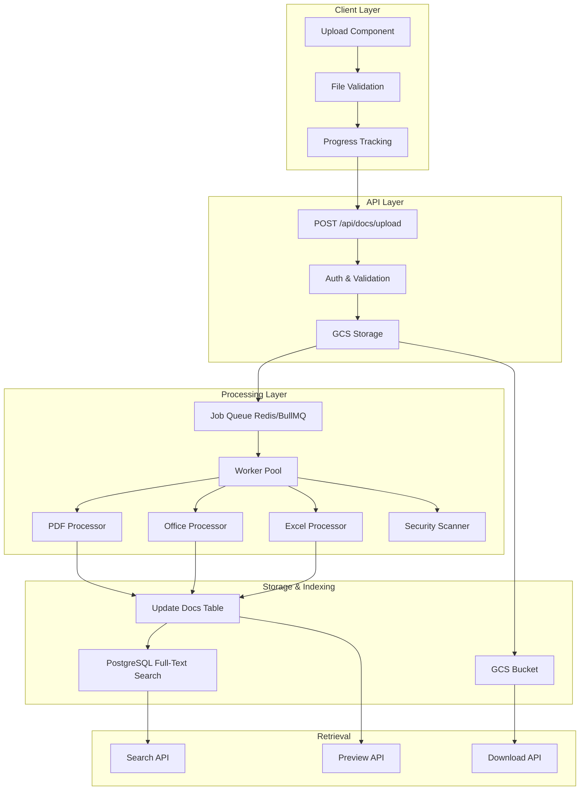

# Document Upload Architecture Plan
## Supporting PDF, PPT, Word, and Excel Files

**Date:** 2026-01-29  
**Status:** Planning Phase  
**Architecture:** Hybrid Approach with Unified Docs Table

---

## Executive Summary

This plan outlines the architecture for adding support for PDF, PowerPoint, Word, and Excel document uploads to the Leanworks Hub platform. The design follows industry best practices and integrates seamlessly with the existing infrastructure.

**Key Decisions:**
- ✅ Use existing [`docs`](../database/schema.sql:416) table with enhanced JSONB content field
- ✅ Leverage existing GCS storage infrastructure ([`server/endpoints/files.ts`](../server/endpoints/files.ts:1))
- ✅ Implement async processing with job queue for scalability
- ✅ Support full-text search across all document types
- ✅ Maintain backward compatibility with existing rich-text docs

---

## Architecture Overview



---

## Current System Analysis

### Existing Infrastructure

**Database Schema:**
- [`docs`](../database/schema.sql:416) table with `content TEXT` field (currently stores TipTap JSON)
- `metadata JSONB` field for extensibility
- Multi-tenant architecture with per-org databases

**File Storage:**
- Google Cloud Storage (GCS) via Firebase Admin SDK
- Bucket: `leanworks-prod`
- Path pattern: `orgs/{orgSlug}/doc-files/{docId}/{fileId}`
- Signed URLs with 365-day expiration
- 10MB file size limit (configurable)

**Existing Endpoints:**
- [`POST /api/files/upload`](../server/endpoints/files.ts:38) - Generic file upload
- [`POST /api/files/refresh`](../server/endpoints/files.ts:210) - Refresh signed URLs

**Technology Stack:**
- Backend: Node.js + Express + TypeScript
- Database: PostgreSQL with JSONB support
- Storage: Google Cloud Storage
- Current packages: multer, uuid, pg, firebase-admin

---

## Proposed Architecture

### 1. Database Schema Enhancement

#### Enhanced Docs Table

```sql
-- Extend existing docs table (no breaking changes)
ALTER TABLE docs 
  ADD COLUMN IF NOT EXISTS doc_type VARCHAR(50) DEFAULT 'rich_text' 
    CHECK (doc_type IN ('rich_text', 'pdf', 'docx', 'pptx', 'xlsx'));

ALTER TABLE docs 
  ADD COLUMN IF NOT EXISTS file_metadata JSONB DEFAULT '{}'::jsonb;

ALTER TABLE docs 
  ADD COLUMN IF NOT EXISTS storage_path VARCHAR(500);

ALTER TABLE docs 
  ADD COLUMN IF NOT EXISTS processing_status VARCHAR(50) DEFAULT 'ready'
    CHECK (processing_status IN ('uploading', 'processing', 'ready', 'error'));

ALTER TABLE docs 
  ADD COLUMN IF NOT EXISTS file_size BIGINT;

ALTER TABLE docs 
  ADD COLUMN IF NOT EXISTS mime_type VARCHAR(100);

-- Indexes for performance
CREATE INDEX IF NOT EXISTS idx_docs_doc_type ON docs(doc_type);
CREATE INDEX IF NOT EXISTS idx_docs_processing_status ON docs(processing_status);
CREATE INDEX IF NOT EXISTS idx_docs_file_metadata ON docs USING GIN(file_metadata);

-- Full-text search index (for extracted content)
CREATE INDEX IF NOT EXISTS idx_docs_content_fts ON docs USING GIN(to_tsvector('english', content));

COMMENT ON COLUMN docs.doc_type IS 'Type of document: rich_text, pdf, docx, pptx, xlsx';
COMMENT ON COLUMN docs.file_metadata IS 'File-specific metadata (page count, sheets, author, etc.)';
COMMENT ON COLUMN docs.storage_path IS 'GCS storage path for uploaded files';
COMMENT ON COLUMN docs.processing_status IS 'Processing status for uploaded files';
```

#### Processing Jobs Table

```sql
-- New table for async processing jobs
CREATE TABLE IF NOT EXISTS doc_processing_jobs (
  id UUID PRIMARY KEY DEFAULT gen_random_uuid(),
  doc_id VARCHAR(50) NOT NULL REFERENCES docs(id) ON DELETE CASCADE,
  job_type VARCHAR(50) NOT NULL, -- 'text_extraction', 'thumbnail_generation', 'virus_scan'
  status VARCHAR(50) NOT NULL DEFAULT 'pending', -- 'pending', 'processing', 'completed', 'failed'
  priority INTEGER DEFAULT 0,
  error_message TEXT,
  retry_count INTEGER DEFAULT 0,
  max_retries INTEGER DEFAULT 3,
  started_at TIMESTAMP,
  completed_at TIMESTAMP,
  created_at TIMESTAMP NOT NULL DEFAULT NOW(),
  updated_at TIMESTAMP DEFAULT NOW()
);

CREATE INDEX IF NOT EXISTS idx_doc_jobs_doc_id ON doc_processing_jobs(doc_id);
CREATE INDEX IF NOT EXISTS idx_doc_jobs_status ON doc_processing_jobs(status);
CREATE INDEX IF NOT EXISTS idx_doc_jobs_created ON doc_processing_jobs(created_at);

COMMENT ON TABLE doc_processing_jobs IS 'Async processing jobs for document uploads';
```

#### Excel Data Table (Optional - for large datasets)

```sql
-- Optional: Separate table for Excel sheet data (if sheets are very large)
CREATE TABLE IF NOT EXISTS excel_sheets (
  id UUID PRIMARY KEY DEFAULT gen_random_uuid(),
  doc_id VARCHAR(50) NOT NULL REFERENCES docs(id) ON DELETE CASCADE,
  sheet_name VARCHAR(255) NOT NULL,
  sheet_index INTEGER NOT NULL,
  row_count INTEGER,
  column_count INTEGER,
  headers JSONB, -- Column headers
  data JSONB, -- Sheet data (consider pagination for large sheets)
  formulas JSONB, -- Extracted formulas
  created_at TIMESTAMP NOT NULL DEFAULT NOW(),
  UNIQUE(doc_id, sheet_index)
);

CREATE INDEX IF NOT EXISTS idx_excel_sheets_doc_id ON excel_sheets(doc_id);

COMMENT ON TABLE excel_sheets IS 'Structured data for Excel spreadsheets (optional, for large datasets)';
```

### 2. Content Structure by Document Type

#### Rich Text Document (Existing)
```typescript
{
  type: "doc",
  content: [
    { type: "paragraph", content: [...] }
  ]
}
```

#### PDF Document
```typescript
{
  type: "pdf",
  extractedText: "Full text content...",
  pageCount: 10,
  pages: [
    {
      pageNumber: 1,
      text: "Page 1 content...",
      thumbnailUrl: "https://storage.googleapis.com/..."
    }
  ],
  metadata: {
    author: "John Doe",
    created: "2024-01-15T10:00:00Z",
    modified: "2024-01-20T15:30:00Z",
    title: "Document Title",
    subject: "Document Subject",
    keywords: ["keyword1", "keyword2"]
  }
}
```

#### Word Document
```typescript
{
  type: "docx",
  extractedText: "Full text content...",
  html: "<p>Converted HTML content...</p>",
  images: [
    {
      id: "img1",
      url: "https://storage.googleapis.com/...",
      caption: "Figure 1",
      width: 800,
      height: 600
    }
  ],
  metadata: {
    author: "Jane Smith",
    created: "2024-01-10T09:00:00Z",
    modified: "2024-01-15T14:20:00Z",
    pageCount: 5,
    wordCount: 1200,
    paragraphCount: 45
  }
}
```

#### PowerPoint Document
```typescript
{
  type: "pptx",
  slideCount: 12,
  slides: [
    {
      index: 1,
      title: "Introduction",
      text: "Slide content...",
      thumbnailUrl: "https://storage.googleapis.com/...",
      notes: "Speaker notes...",
      layout: "title-slide"
    }
  ],
  metadata: {
    author: "Bob Johnson",
    created: "2024-01-05T11:00:00Z",
    modified: "2024-01-12T16:45:00Z",
    theme: "Corporate"
  }
}
```

#### Excel Document
```typescript
{
  type: "xlsx",
  sheetCount: 3,
  sheets: [
    {
      name: "Sheet1",
      index: 0,
      rowCount: 100,
      columnCount: 10,
      headers: ["Name", "Email", "Phone", "Department"],
      previewData: [
        ["John Doe", "john@example.com", "555-1234", "Engineering"],
        ["Jane Smith", "jane@example.com", "555-5678", "Marketing"]
      ],
      hasFormulas: true,
      hasCharts: false
    }
  ],
  metadata: {
    author: "Alice Brown",
    created: "2024-01-08T08:00:00Z",
    modified: "2024-01-15T13:30:00Z",
    totalRows: 250,
    totalColumns: 15
  }
}
```

### 3. API Endpoints Design

#### Upload Endpoint
```typescript
POST /api/docs/upload
Content-Type: multipart/form-data

Headers:
  Authorization: Bearer <token>
  x-org-id: <orgId>
  x-org-slug: <orgSlug>

Body:
  file: <binary>
  title: string (optional, defaults to filename)
  projectId: string (optional)
  teamId: string (optional)
  visibility: 'all_members' | 'specific_members'
  visibleToMembers: string[] (optional)

Response:
{
  success: true,
  doc: {
    id: "doc-123",
    title: "Q4 Report.pdf",
    docType: "pdf",
    processingStatus: "processing",
    fileSize: 2048576,
    mimeType: "application/pdf",
    createdAt: "2024-01-15T10:00:00Z"
  }
}
```

#### Status Polling Endpoint
```typescript
GET /api/docs/:docId/status

Response:
{
  id: "doc-123",
  processingStatus: "processing" | "ready" | "error",
  progress: 75, // percentage
  jobs: [
    {
      type: "text_extraction",
      status: "completed"
    },
    {
      type: "thumbnail_generation",
      status: "processing"
    }
  ],
  error: null | "Error message"
}
```

#### Preview Endpoint
```typescript
GET /api/docs/:docId/preview

Response:
{
  id: "doc-123",
  title: "Q4 Report.pdf",
  docType: "pdf",
  content: { /* type-specific content */ },
  thumbnails: ["url1", "url2"],
  downloadUrl: "https://storage.googleapis.com/...",
  metadata: { /* file metadata */ }
}
```

#### Download Endpoint
```typescript
GET /api/docs/:docId/download

Response:
  - Redirects to signed GCS URL
  - Or streams file directly
```

#### Search Endpoint (Enhanced)
```typescript
POST /api/docs/search

Body:
{
  query: "search term",
  docTypes: ["pdf", "docx"], // optional filter
  projectId: "proj-123", // optional
  teamId: "team-456", // optional
  dateRange: {
    start: "2024-01-01",
    end: "2024-12-31"
  }
}

Response:
{
  results: [
    {
      id: "doc-123",
      title: "Q4 Report.pdf",
      docType: "pdf",
      snippet: "...matching text...",
      relevance: 0.95,
      highlights: ["match1", "match2"],
      createdAt: "2024-01-15T10:00:00Z"
    }
  ],
  total: 42,
  page: 1,
  pageSize: 20
}
```

### 4. Processing Libraries

#### Required NPM Packages

```json
{
  "dependencies": {
    // PDF Processing
    "pdf-parse": "^1.1.1",           // Text extraction
    "pdf-lib": "^1.17.1",            // PDF manipulation
    "pdfjs-dist": "^4.0.0",          // Rendering/thumbnails
    
    // Office Documents
    "mammoth": "^1.6.0",             // Word to HTML/text
    "officegen": "^0.6.5",           // Office document generation
    
    // PowerPoint
    "pptx-parser": "^1.0.0",         // PPT parsing (or custom solution)
    
    // Excel
    "xlsx": "^0.18.5",               // Excel parsing/writing
    "exceljs": "^4.4.0",             // Advanced Excel operations
    
    // Job Queue
    "bullmq": "^5.0.0",              // Redis-based job queue
    "ioredis": "^5.3.2",             // Redis client
    
    // Security
    "clamscan": "^2.1.2",            // Virus scanning (requires ClamAV)
    
    // Image Processing (for thumbnails)
    "sharp": "^0.34.5"               // Already installed
  }
}
```

#### Processor Service Architecture

```typescript
// server/services/document-processor.ts

interface DocumentProcessor {
  canProcess(mimeType: string): boolean;
  process(file: Buffer, metadata: FileMetadata): Promise<ProcessedDocument>;
  generateThumbnails(file: Buffer): Promise<string[]>;
}

class PDFProcessor implements DocumentProcessor {
  async process(file: Buffer, metadata: FileMetadata): Promise<ProcessedDocument> {
    // Extract text using pdf-parse
    const pdfData = await pdfParse(file);
    
    // Extract metadata
    const pdfMetadata = {
      pageCount: pdfData.numpages,
      author: pdfData.info?.Author,
      title: pdfData.info?.Title,
      // ...
    };
    
    // Generate thumbnails for first 3 pages
    const thumbnails = await this.generateThumbnails(file);
    
    return {
      extractedText: pdfData.text,
      content: {
        type: 'pdf',
        extractedText: pdfData.text,
        pageCount: pdfData.numpages,
        metadata: pdfMetadata,
        thumbnails
      }
    };
  }
  
  async generateThumbnails(file: Buffer): Promise<string[]> {
    // Use pdfjs-dist to render pages as images
    // Upload to GCS and return URLs
  }
}

class WordProcessor implements DocumentProcessor {
  async process(file: Buffer, metadata: FileMetadata): Promise<ProcessedDocument> {
    // Use mammoth to extract text and HTML
    const result = await mammoth.convertToHtml({ buffer: file });
    const textResult = await mammoth.extractRawText({ buffer: file });
    
    return {
      extractedText: textResult.value,
      content: {
        type: 'docx',
        extractedText: textResult.value,
        html: result.value,
        metadata: {
          // Extract from file
        }
      }
    };
  }
}

class ExcelProcessor implements DocumentProcessor {
  async process(file: Buffer, metadata: FileMetadata): Promise<ProcessedDocument> {
    const workbook = XLSX.read(file, { type: 'buffer' });
    
    const sheets = workbook.SheetNames.map((name, index) => {
      const sheet = workbook.Sheets[name];
      const data = XLSX.utils.sheet_to_json(sheet, { header: 1 });
      
      return {
        name,
        index,
        rowCount: data.length,
        columnCount: data[0]?.length || 0,
        headers: data[0] || [],
        previewData: data.slice(1, 11) // First 10 rows
      };
    });
    
    return {
      extractedText: this.extractTextFromSheets(sheets),
      content: {
        type: 'xlsx',
        sheetCount: sheets.length,
        sheets,
        metadata: {
          // Extract from file
        }
      }
    };
  }
}

// Factory pattern
class DocumentProcessorFactory {
  private processors: Map<string, DocumentProcessor> = new Map();
  
  constructor() {
    this.processors.set('application/pdf', new PDFProcessor());
    this.processors.set('application/vnd.openxmlformats-officedocument.wordprocessingml.document', new WordProcessor());
    this.processors.set('application/vnd.openxmlformats-officedocument.presentationml.presentation', new PowerPointProcessor());
    this.processors.set('application/vnd.openxmlformats-officedocument.spreadsheetml.sheet', new ExcelProcessor());
  }
  
  getProcessor(mimeType: string): DocumentProcessor | null {
    return this.processors.get(mimeType) || null;
  }
}
```

### 5. Job Queue Architecture

```typescript
// server/services/job-queue.ts

import { Queue, Worker, Job } from 'bullmq';
import Redis from 'ioredis';

const connection = new Redis({
  host: process.env.REDIS_HOST || 'localhost',
  port: parseInt(process.env.REDIS_PORT || '6379'),
  maxRetriesPerRequest: null
});

// Job types
interface DocumentProcessingJob {
  docId: string;
  orgSlug: string;
  storagePath: string;
  mimeType: string;
  fileSize: number;
}

// Create queue
export const documentQueue = new Queue<DocumentProcessingJob>('document-processing', {
  connection,
  defaultJobOptions: {
    attempts: 3,
    backoff: {
      type: 'exponential',
      delay: 2000
    },
    removeOnComplete: {
      age: 24 * 3600, // Keep completed jobs for 24 hours
      count: 1000
    },
    removeOnFail: {
      age: 7 * 24 * 3600 // Keep failed jobs for 7 days
    }
  }
});

// Worker
export const documentWorker = new Worker<DocumentProcessingJob>(
  'document-processing',
  async (job: Job<DocumentProcessingJob>) => {
    const { docId, orgSlug, storagePath, mimeType, fileSize } = job.data;
    
    // Update job status
    await updateDocProcessingStatus(docId, 'processing');
    
    try {
      // Download file from GCS
      const fileBuffer = await downloadFromGCS(storagePath);
      
      // Get appropriate processor
      const processor = processorFactory.getProcessor(mimeType);
      if (!processor) {
        throw new Error(`No processor found for MIME type: ${mimeType}`);
      }
      
      // Process document
      job.updateProgress(25);
      const result = await processor.process(fileBuffer, { mimeType, fileSize });
      
      // Generate thumbnails
      job.updateProgress(50);
      const thumbnails = await processor.generateThumbnails(fileBuffer);
      
      // Virus scan (optional)
      job.updateProgress(75);
      await virusScan(fileBuffer);
      
      // Update database
      job.updateProgress(90);
      await updateDocContent(docId, result.content, result.extractedText);
      
      // Update status
      await updateDocProcessingStatus(docId, 'ready');
      
      job.updateProgress(100);
      
      return { success: true, docId };
    } catch (error) {
      await updateDocProcessingStatus(docId, 'error', error.message);
      throw error;
    }
  },
  {
    connection,
    concurrency: 5, // Process 5 documents concurrently
    limiter: {
      max: 10,
      duration: 1000 // Max 10 jobs per second
    }
  }
);

// Event handlers
documentWorker.on('completed', (job) => {
  console.log(`Job ${job.id} completed for doc ${job.data.docId}`);
});

documentWorker.on('failed', (job, err) => {
  console.error(`Job ${job?.id} failed for doc ${job?.data.docId}:`, err);
});

documentWorker.on('progress', (job, progress) => {
  console.log(`Job ${job.id} progress: ${progress}%`);
});
```

### 6. Security Considerations

#### File Validation

```typescript
// server/middleware/file-validation.ts

const ALLOWED_MIME_TYPES = [
  'application/pdf',
  'application/vnd.openxmlformats-officedocument.wordprocessingml.document',
  'application/vnd.openxmlformats-officedocument.presentationml.presentation',
  'application/vnd.openxmlformats-officedocument.spreadsheetml.sheet'
];

const MAX_FILE_SIZE = 50 * 1024 * 1024; // 50MB

export function validateUploadedFile(file: Express.Multer.File): ValidationResult {
  // Check file size
  if (file.size > MAX_FILE_SIZE) {
    return { valid: false, error: 'File size exceeds 50MB limit' };
  }
  
  // Check MIME type
  if (!ALLOWED_MIME_TYPES.includes(file.mimetype)) {
    return { valid: false, error: 'File type not supported' };
  }
  
  // Check magic bytes (file signature)
  const magicBytes = file.buffer.slice(0, 4);
  if (!isValidFileSignature(magicBytes, file.mimetype)) {
    return { valid: false, error: 'File signature does not match MIME type' };
  }
  
  return { valid: true };
}

function isValidFileSignature(magicBytes: Buffer, mimeType: string): boolean {
  const signatures: Record<string, Buffer[]> = {
    'application/pdf': [Buffer.from([0x25, 0x50, 0x44, 0x46])], // %PDF
    'application/vnd.openxmlformats-officedocument.wordprocessingml.document': [
      Buffer.from([0x50, 0x4B, 0x03, 0x04]) // PK (ZIP)
    ],
    // Add more signatures
  };
  
  const validSignatures = signatures[mimeType] || [];
  return validSignatures.some(sig => magicBytes.equals(sig));
}
```

#### Virus Scanning

```typescript
// server/services/virus-scanner.ts

import NodeClam from 'clamscan';

const clamscan = await new NodeClam().init({
  clamdscan: {
    host: process.env.CLAMAV_HOST || 'localhost',
    port: parseInt(process.env.CLAMAV_PORT || '3310')
  }
});

export async function scanFile(fileBuffer: Buffer): Promise<ScanResult> {
  try {
    const { isInfected, viruses } = await clamscan.scanBuffer(fileBuffer);
    
    if (isInfected) {
      return {
        safe: false,
        threats: viruses
      };
    }
    
    return { safe: true };
  } catch (error) {
    console.error('Virus scan error:', error);
    // Fail-safe: reject file if scan fails
    return { safe: false, error: 'Scan failed' };
  }
}
```

#### Rate Limiting

```typescript
// server/middleware/rate-limiter.ts

import rateLimit from 'express-rate-limit';

export const uploadRateLimiter = rateLimit({
  windowMs: 15 * 60 * 1000, // 15 minutes
  max: 20, // 20 uploads per window per user
  message: 'Too many uploads, please try again later',
  standardHeaders: true,
  legacyHeaders: false,
  keyGenerator: (req) => {
    return `${req.user.email}:${req.orgId}`;
  }
});
```

### 7. Frontend Components

#### Upload Component

```typescript
// src/components/DocumentUpload.tsx

interface DocumentUploadProps {
  projectId?: string;
  teamId?: string;
  onUploadComplete?: (doc: Doc) => void;
}

export function DocumentUpload({ projectId, teamId, onUploadComplete }: DocumentUploadProps) {
  const [uploading, setUploading] = useState(false);
  const [progress, setProgress] = useState(0);
  const [processingStatus, setProcessingStatus] = useState<ProcessingStatus | null>(null);
  
  const handleFileSelect = async (file: File) => {
    // Validate file
    if (!isValidFileType(file)) {
      toast.error('File type not supported');
      return;
    }
    
    if (file.size > 50 * 1024 * 1024) {
      toast.error('File size exceeds 50MB limit');
      return;
    }
    
    setUploading(true);
    
    try {
      // Upload file
      const formData = new FormData();
      formData.append('file', file);
      formData.append('title', file.name);
      if (projectId) formData.append('projectId', projectId);
      if (teamId) formData.append('teamId', teamId);
      
      const response = await fetch('/api/docs/upload', {
        method: 'POST',
        headers: {
          'Authorization': `Bearer ${token}`,
          'x-org-id': orgId,
          'x-org-slug': orgSlug
        },
        body: formData
      });
      
      const { doc } = await response.json();
      
      // Poll for processing status
      await pollProcessingStatus(doc.id);
      
      onUploadComplete?.(doc);
      toast.success('Document uploaded successfully');
    } catch (error) {
      toast.error('Upload failed');
    } finally {
      setUploading(false);
    }
  };
  
  const pollProcessingStatus = async (docId: string) => {
    const maxAttempts = 60; // 5 minutes max
    let attempts = 0;
    
    while (attempts < maxAttempts) {
      const response = await fetch(`/api/docs/${docId}/status`);
      const status = await response.json();
      
      setProcessingStatus(status);
      
      if (status.processingStatus === 'ready') {
        break;
      }
      
      if (status.processingStatus === 'error') {
        throw new Error(status.error);
      }
      
      await new Promise(resolve => setTimeout(resolve, 5000)); // Poll every 5 seconds
      attempts++;
    }
  };
  
  return (
    <div className="document-upload">
      <input
        type="file"
        accept=".pdf,.docx,.pptx,.xlsx"
        onChange={(e) => e.target.files?.[0] && handleFileSelect(e.target.files[0])}
        disabled={uploading}
      />
      
      {uploading && (
        <div className="upload-progress">
          <Progress value={progress} />
          {processingStatus && (
            <div className="processing-status">
              <p>Processing: {processingStatus.processingStatus}</p>
              {processingStatus.jobs?.map(job => (
                <div key={job.type}>
                  {job.type}: {job.status}
                </div>
              ))}
            </div>
          )}
        </div>
      )}
    </div>
  );
}
```

#### Document Viewer Component

```typescript
// src/components/DocumentViewer.tsx

interface DocumentViewerProps {
  doc: Doc;
}

export function DocumentViewer({ doc }: DocumentViewerProps) {
  switch (doc.docType) {
    case 'pdf':
      return <PDFViewer doc={doc} />;
    case 'docx':
      return <WordViewer doc={doc} />;
    case 'pptx':
      return <PowerPointViewer doc={doc} />;
    case 'xlsx':
      return <ExcelViewer doc={doc} />;
    case 'rich_text':
    default:
      return <RichTextEditor doc={doc} />;
  }
}

function PDFViewer({ doc }: { doc: Doc }) {
  const content = JSON.parse(doc.content);
  
  return (
    <div className="pdf-viewer">
      <div className="pdf-toolbar">
        <Button onClick={() => downloadFile(doc.id)}>
          <Download /> Download
        </Button>
        <span>{content.pageCount} pages</span>
      </div>
      
      <div className="pdf-thumbnails">
        {content.pages?.map((page: any) => (
          
        ))}
      </div>
      
      <div className="pdf-text-content">
        <pre>{content.extractedText}</pre>
      </div>
    </div>
  );
}

function ExcelViewer({ doc }: { doc: Doc }) {
  const content = JSON.parse(doc.content);
  const [activeSheet, setActiveSheet] = useState(0);
  
  return (
    <div className="excel-viewer">
      <Tabs value={activeSheet.toString()} onValueChange={(v) => setActiveSheet(parseInt(v))}>
        <TabsList>
          {content.sheets?.map((sheet: any, index: number) => (
            <TabsTrigger key={index} value={index.toString()}>
              {sheet.name}
            </TabsTrigger>
          ))}
        </TabsList>
        
        {content.sheets?.map((sheet: any, index: number) => (
          <TabsContent key={index} value={index.toString()}>
            <Table>
              <TableHeader>
                <TableRow>
                  {sheet.headers?.map((header: string, i: number) => (
                    <TableHead key={i}>{header}</TableHead>
                  ))}
                </TableRow>
              </TableHeader>
              <TableBody>
                {sheet.previewData?.map((row: any[], rowIndex: number) => (
                  <TableRow key={rowIndex}>
                    {row.map((cell, cellIndex) => (
                      <TableCell key={cellIndex}>{cell}</TableCell>
                    ))}
                  </TableRow>
                ))}
              </TableBody>
            </Table>
            
            {sheet.rowCount > 10 && (
              <p className="text-sm text-muted-foreground mt-2">
                Showing 10 of {sheet.rowCount} rows
              </p>
            )}
          </TabsContent>
        ))}
      </Tabs>
    </div>
  );
}
```

### 8. Search Implementation

#### Full-Text Search with PostgreSQL

```sql
-- Create full-text search function
CREATE OR REPLACE FUNCTION search_docs(
  search_query TEXT,
  org_id_param VARCHAR(50),
  doc_types_param VARCHAR(50)[] DEFAULT NULL,
  project_id_param VARCHAR(50) DEFAULT NULL,
  limit_param INTEGER DEFAULT 20,
  offset_param INTEGER DEFAULT 0
)
RETURNS TABLE (
  id VARCHAR(50),
  title VARCHAR(255),
  doc_type VARCHAR(50),
  snippet TEXT,
  relevance REAL,
  created_at TIMESTAMP
) AS $$
BEGIN
  RETURN QUERY
  SELECT 
    d.id,
    d.title,
    d.doc_type,
    ts_headline('english', d.content, plainto_tsquery('english', search_query)) AS snippet,
    ts_rank(to_tsvector('english', d.content), plainto_tsquery('english', search_query)) AS relevance,
    d.created_at
  FROM docs d
  WHERE 
    to_tsvector('english', d.content) @@ plainto_tsquery('english', search_query)
    AND (doc_types_param IS NULL OR d.doc_type = ANY(doc_types_param))
    AND (project_id_param IS NULL OR d.project_id = project_id_param)
    AND d.processing_status = 'ready'
  ORDER BY relevance DESC, d.created_at DESC
  LIMIT limit_param
  OFFSET offset_param;
END;
$$ LANGUAGE plpgsql;
```

#### Search Service

```typescript
// server/services/search-service.ts

export async function searchDocuments(params: SearchParams): Promise<SearchResults> {
  const {
    query,
    docTypes,
    projectId,
    teamId,
    dateRange,
    page = 1,
    pageSize = 20
  } = params;
  
  const offset = (page - 1) * pageSize;
  
  const results = await db.query(
    `SELECT * FROM search_docs($1, $2, $3, $4, $5, $6)`,
    [query, orgId, docTypes, projectId, pageSize, offset]
  );
  
  // Get total count
  const countResult = await db.query(
    `SELECT COUNT(*) FROM docs 
     WHERE to_tsvector('english', content) @@ plainto_tsquery('english', $1)
     AND processing_status = 'ready'`,
    [query]
  );
  
  return {
    results: results.rows,
    total: parseInt(countResult.rows[0].count),
    page,
    pageSize
  };
}
```

### 9. Performance Optimization

#### Caching Strategy

```typescript
// server/services/cache-service.ts

import Redis from 'ioredis';

const redis = new Redis({
  host: process.env.REDIS_HOST || 'localhost',
  port: parseInt(process.env.REDIS_PORT || '6379')
});

// Cache document content
export async function getCachedDocument(docId: string): Promise<Doc | null> {
  const cached = await redis.get(`doc:${docId}`);
  return cached ? JSON.parse(cached) : null;
}

export async function cacheDocument(doc: Doc, ttl: number = 3600): Promise<void> {
  await redis.setex(`doc:${doc.id}`, ttl, JSON.stringify(doc));
}

// Cache search results
export async function getCachedSearchResults(queryHash: string): Promise<SearchResults | null> {
  const cached = await redis.get(`search:${queryHash}`);
  return cached ? JSON.parse(cached) : null;
}

export async function cacheSearchResults(
  queryHash: string,
  results: SearchResults,
  ttl: number = 300
): Promise<void> {
  await redis.setex(`search:${queryHash}`, ttl, JSON.stringify(results));
}
```

#### Database Optimization

```sql
-- Partial indexes for common queries
CREATE INDEX IF NOT EXISTS idx_docs_ready_created 
  ON docs(created_at DESC) 
  WHERE processing_status = 'ready';

CREATE INDEX IF NOT EXISTS idx_docs_project_ready 
  ON docs(project_id, created_at DESC) 
  WHERE processing_status = 'ready';

-- Materialized view for document statistics
CREATE MATERIALIZED VIEW IF NOT EXISTS doc_stats AS
SELECT 
  doc_type,
  COUNT(*) as total_count,
  SUM(file_size) as total_size,
  AVG(file_size) as avg_size,
  COUNT(CASE WHEN processing_status = 'ready' THEN 1 END) as ready_count,
  COUNT(CASE WHEN processing_status = 'error' THEN 1 END) as error_count
FROM docs
GROUP BY doc_type;

CREATE UNIQUE INDEX IF NOT EXISTS idx_doc_stats_type ON doc_stats(doc_type);
```

### 10. Monitoring & Observability

#### Metrics to Track

```typescript
// server/services/metrics-service.ts

export interface DocumentMetrics {
  // Upload metrics
  totalUploads: number;
  uploadsByType: Record<string, number>;
  uploadSuccessRate: number;
  avgUploadTime: number;
  
  // Processing metrics
  totalProcessingJobs: number;
  processingSuccessRate: number;
  avgProcessingTime: number;
  queueDepth: number;
  
  // Storage metrics
  totalStorageUsed: number;
  storageByType: Record<string, number>;
  
  // Search metrics
  totalSearches: number;
  avgSearchTime: number;
  searchSuccessRate: number;
}

export async function collectMetrics(): Promise<DocumentMetrics> {
  // Collect from database, Redis, and application logs
  // Export to monitoring system (Prometheus, CloudWatch, etc.)
}
```

#### Logging

```typescript
// server/utils/logger.ts

import pino from 'pino';

export const logger = pino({
  level: process.env.LOG_LEVEL || 'info',
  transport: {
    target: 'pino-pretty',
    options: {
      colorize: true
    }
  }
});

// Usage
logger.info({ docId, mimeType, fileSize }, 'Document upload started');
logger.error({ docId, error }, 'Document processing failed');
```

### 11. Error Handling

#### Error Types

```typescript
// server/types/errors.ts

export class DocumentError extends Error {
  constructor(
    message: string,
    public code: string,
    public statusCode: number = 500,
    public details?: any
  ) {
    super(message);
    this.name = 'DocumentError';
  }
}

export class ValidationError extends DocumentError {
  constructor(message: string, details?: any) {
    super(message, 'VALIDATION_ERROR', 400, details);
  }
}

export class ProcessingError extends DocumentError {
  constructor(message: string, details?: any) {
    super(message, 'PROCESSING_ERROR', 500, details);
  }
}

export class StorageError extends DocumentError {
  constructor(message: string, details?: any) {
    super(message, 'STORAGE_ERROR', 500, details);
  }
}
```

#### Error Handler Middleware

```typescript
// server/middleware/error-handler.ts

export function errorHandler(
  err: Error,
  req: Request,
  res: Response,
  next: NextFunction
) {
  if (err instanceof DocumentError) {
    logger.error({ error: err, docId: req.params.docId }, err.message);
    
    return res.status(err.statusCode).json({
      error: err.message,
      code: err.code,
      details: err.details
    });
  }
  
  // Unhandled errors
  logger.error({ error: err }, 'Unhandled error');
  
  res.status(500).json({
    error: 'Internal server error',
    code: 'INTERNAL_ERROR'
  });
}
```

### 12. Testing Strategy

#### Unit Tests

```typescript
// server/services/__tests__/document-processor.test.ts

describe('PDFProcessor', () => {
  let processor: PDFProcessor;
  
  beforeEach(() => {
    processor = new PDFProcessor();
  });
  
  it('should extract text from PDF', async () => {
    const pdfBuffer = await fs.readFile('test-files/sample.pdf');
    const result = await processor.process(pdfBuffer, { mimeType: 'application/pdf' });
    
    expect(result.extractedText).toBeTruthy();
    expect(result.content.type).toBe('pdf');
    expect(result.content.pageCount).toBeGreaterThan(0);
  });
  
  it('should generate thumbnails', async () => {
    const pdfBuffer = await fs.readFile('test-files/sample.pdf');
    const thumbnails = await processor.generateThumbnails(pdfBuffer);
    
    expect(thumbnails).toHaveLength(3);
    expect(thumbnails[0]).toMatch(/^https:\/\//);
  });
});
```

#### Integration Tests

```typescript
// server/endpoints/__tests__/docs-upload.test.ts

describe('POST /api/docs/upload', () => {
  it('should upload PDF document', async () => {
    const response = await request(app)
      .post('/api/docs/upload')
      .set('Authorization', `Bearer ${token}`)
      .set('x-org-id', orgId)
      .attach('file', 'test-files/sample.pdf')
      .field('title', 'Test PDF');
    
    expect(response.status).toBe(200);
    expect(response.body.doc.docType).toBe('pdf');
    expect(response.body.doc.processingStatus).toBe('processing');
  });
  
  it('should reject invalid file type', async () => {
    const response = await request(app)
      .post('/api/docs/upload')
      .set('Authorization', `Bearer ${token}`)
      .set('x-org-id', orgId)
      .attach('file', 'test-files/malicious.exe');
    
    expect(response.status).toBe(400);
    expect(response.body.error).toContain('not supported');
  });
});
```

---

## Migration Strategy

### Phase 1: Database Schema (Week 1)

1. Create migration script for schema changes
2. Add new columns to docs table
3. Create doc_processing_jobs table
4. Create indexes
5. Test on staging environment

### Phase 2: Backend Infrastructure (Week 2-3)

1. Install required NPM packages
2. Implement document processor services
3. Set up job queue with BullMQ
4. Implement upload endpoint
5. Implement processing workers
6. Add error handling and logging

### Phase 3: API Endpoints (Week 3-4)

1. Implement upload endpoint
2. Implement status polling endpoint
3. Implement preview endpoint
4. Implement download endpoint
5. Enhance search endpoint
6. Add validation and security

### Phase 4: Frontend Components (Week 4-5)

1. Create DocumentUpload component
2. Create DocumentViewer component
3. Create type-specific viewers (PDF, Word, Excel, PPT)
4. Update DocsList to show all document types
5. Add upload UI to existing pages

### Phase 5: Testing & Optimization (Week 5-6)

1. Write unit tests
2. Write integration tests
3. Performance testing
4. Security testing
5. Load testing
6. Optimize based on results

### Phase 6: Deployment (Week 6)

1. Deploy to staging
2. User acceptance testing
3. Deploy to production
4. Monitor metrics
5. Gather feedback

---

## Rollback Plan

1. Keep old schema intact (new columns are additive)
2. Feature flag for document upload
3. Database backup before migration
4. Ability to disable processing workers
5. Revert to previous deployment if critical issues

---

## Cost Estimation

### Infrastructure Costs

- **Redis**: $20-50/month (for job queue)
- **GCS Storage**: $0.02/GB/month (estimated $50-100/month for 2-5TB)
- **GCS Bandwidth**: $0.12/GB (estimated $50-100/month)
- **Database**: Minimal increase (existing PostgreSQL)
- **Compute**: May need to scale workers (estimated $100-200/month)

**Total Estimated Monthly Cost**: $220-450

### Development Costs

- Backend development: 3-4 weeks
- Frontend development: 2-3 weeks
- Testing & QA: 1-2 weeks
- **Total**: 6-9 weeks

---

## Success Metrics

1. **Upload Success Rate**: > 99%
2. **Processing Success Rate**: > 95%
3. **Average Upload Time**: < 5 seconds
4. **Average Processing Time**: < 30 seconds
5. **Search Response Time**: < 500ms
6. **User Adoption**: 50% of users upload at least one document in first month

---

## Future Enhancements

1. **OCR Support**: Extract text from scanned PDFs and images
2. **Version Control**: Track document versions
3. **Collaborative Editing**: Real-time collaboration on Office documents
4. **Advanced Analytics**: Document insights and analytics
5. **AI-Powered Features**: Summarization, Q&A, insights
6. **Mobile Support**: Mobile app for document viewing
7. **Offline Support**: Download for offline viewing
8. **Integration**: Sync with Google Drive, Dropbox, OneDrive

---

## References

- [PostgreSQL Full-Text Search](https://www.postgresql.org/docs/current/textsearch.html)
- [BullMQ Documentation](https://docs.bullmq.io/)
- [Google Cloud Storage Best Practices](https://cloud.google.com/storage/docs/best-practices)
- [pdf-parse NPM Package](https://www.npmjs.com/package/pdf-parse)
- [mammoth NPM Package](https://www.npmjs.com/package/mammoth)
- [xlsx NPM Package](https://www.npmjs.com/package/xlsx)
