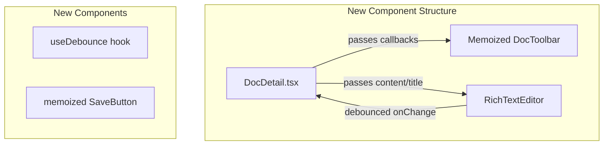

# Plan: Fix Save Button Re-render Issue

## Problem
Every keystroke in the RichTextEditor causes the Save button to re-render due to:
1. `onChange` → `setContent` → parent re-render → new inline function references
2. No memoization of toolbar action buttons
3. State lifted too high causing unnecessary re-renders

## Solution: Industrial Best Practices

### Architecture Overview



## Implementation Steps

### Step 1: Create useDebounce Hook
**File:** `src/hooks/useDebounce.ts`

```typescript
import { useState, useEffect, useRef, useCallback } from 'react';

export function useDebounce<T>(value: T, delay: number): T {
  const [debouncedValue, setDebouncedValue] = useState<T>(value);

  useEffect(() => {
    const timer = setTimeout(() => {
      setDebouncedValue(value);
    }, delay);

    return () => {
      clearTimeout(timer);
    };
  }, [value, delay]);

  return debouncedValue;
}

export function useDebouncedCallback<T extends (...args: any[]) => any>(
  callback: T,
  delay: number
): T {
  const timeoutRef = useRef<ReturnType<typeof setTimeout> | null>(null);

  useEffect(() => {
    return () => {
      if (timeoutRef.current) {
        clearTimeout(timeoutRef.current);
      }
    };
  }, []);

  return useCallback(
    (...args: Parameters<T>) => {
      if (timeoutRef.current) {
        clearTimeout(timeoutRef.current);
      }

      timeoutRef.current = setTimeout(() => {
        callback(...args);
      }, delay);
    },
    [callback, delay]
  ) as T;
}
```

### Step 2: Create Memoized DocToolbar Component
**File:** `src/components/DocToolbar.tsx`

```typescript
import { memo, useCallback } from 'react';
import { Button } from '@/components/ui/button';
import { DocSaveStatus } from '@/components/DocSaveStatus';
import { DropdownMenu, DropdownMenuContent, DropdownMenuItem, DropdownMenuTrigger } from '@/components/ui/dropdown-menu';
import { MoreVertical, Share2, Mail, Paperclip, Trash2, ArrowLeft } from 'lucide-react';
import { cn } from '@/lib/utils';
import type { SaveStatus } from '@/hooks/useAutoSave';

interface DocToolbarProps {
  title: string;
  onBack: () => void;
  onSave: () => void;
  saveStatus: SaveStatus;
  lastSavedAt?: Date | null;
  onRetry?: () => void;
  onShare: () => void;
  onShareViaEmail: () => void;
  onAttachedFiles: () => void;
  onDelete: () => void;
  isOwner: boolean;
  filesCount: number;
  isNew: boolean;
  isSaving: boolean;
}

const SaveButton = memo(function SaveButton({ 
  onClick, 
  disabled 
}: { 
  onClick: () => void; 
  disabled: boolean; 
}) {
  return (
    <Button 
      variant="default" 
      size="sm" 
      onClick={onClick}
      disabled={disabled}
      className="bg-black text-white hover:bg-black/90"
    >
      Save
    </Button>
  );
});

const BackButton = memo(function BackButton({ onClick }: { onClick: () => void }) {
  return (
    <Button 
      variant="ghost" 
      size="sm" 
      onClick={onClick}
      className="hover:bg-muted/50"
    >
      <ArrowLeft className="h-4 w-4" />
    </Button>
  );
});

const MoreActionsMenu = memo(function MoreActionsMenu({ 
  onShare, 
  onShareViaEmail, 
  onAttachedFiles, 
  onDelete,
  isOwner,
  filesCount
}: Omit<DocToolbarProps, 'title' | 'onBack' | 'onSave' | 'saveStatus' | 'lastSavedAt' | 'onRetry' | 'isNew' | 'isSaving'>) {
  return (
    <DropdownMenu>
      <DropdownMenuTrigger asChild>
        <Button variant="ghost" size="sm">
          <MoreVertical className="h-4 w-4" />
        </Button>
      </DropdownMenuTrigger>
      <DropdownMenuContent align="end">
        {isOwner && (
          <DropdownMenuItem onClick={onShare}>
            <Share2 className="mr-2 h-4 w-4" />
            Limit Visibility
          </DropdownMenuItem>
        )}
        {isOwner && (
          <DropdownMenuItem onClick={onShareViaEmail}>
            <Mail className="mr-2 h-4 w-4" />
            Share
          </DropdownMenuItem>
        )}
        <DropdownMenuItem onClick={onAttachedFiles}>
          <Paperclip className="mr-2 h-4 w-4" />
          Attached Files {filesCount > 0 && `(${filesCount})`}
        </DropdownMenuItem>
        {isOwner && (
          <DropdownMenuItem 
            onClick={onDelete}
            className="text-destructive focus:text-destructive"
          >
            <Trash2 className="mr-2 h-4 w-4" />
            Delete
          </DropdownMenuItem>
        )}
      </DropdownMenuContent>
    </DropdownMenu>
  );
});

export const DocToolbar = memo(function DocToolbar({
  title,
  onBack,
  onSave,
  saveStatus,
  lastSavedAt,
  onRetry,
  onShare,
  onShareViaEmail,
  onAttachedFiles,
  onDelete,
  isOwner,
  filesCount,
  isNew,
  isSaving,
}: DocToolbarProps) {
  const docActions = !isNew ? [
    {
      label: `Attached Files ${filesCount > 0 ? `(${filesCount})` : ''}`,
      icon: <Paperclip className="h-4 w-4" />,
      onClick: onAttachedFiles,
    },
  ] : [];

  return (
    <div className="flex items-center gap-2 flex-shrink-0">
      <BackButton onClick={onBack} />
      <div>
        <SaveButton onClick={onSave} disabled={isSaving} />
      </div>
      {!isNew && (
        <MoreActionsMenu
          onShare={onShare}
          onShareViaEmail={onShareViaEmail}
          onAttachedFiles={onAttachedFiles}
          onDelete={onDelete}
          isOwner={isOwner}
          filesCount={filesCount}
        />
      )}
    </div>
  );
});
```

### Step 3: Update RichTextEditor to Accept Debounced onChange
**File:** `src/components/RichTextEditor.tsx`

Add optional `onChangeDebounced` prop and integrate with the editor:

```typescript
interface RichTextEditorProps {
  // ... existing props
  onChangeDebounced?: (content: string) => void;
  debounceDelay?: number;
}

// Inside component, update onUpdate handler:
onUpdate: ({ editor }) => {
  if (!isUpdatingRef.current) {
    const html = editor.getHTML();
    contentRef.current = html;
    
    if (isUndoRedoRef.current) {
      lastContentPropRef.current = html;
      onChange(html);
      setTimeout(() => {
        isUndoRedoRef.current = false;
      }, 0);
    } else {
      lastContentPropRef.current = html;
      onChange(html);
      
      // Call debounced callback if provided
      if (onChangeDebounced) {
        onChangeDebounced(html);
      }
    }
  }
},
```

### Step 4: Update DocDetail.tsx
**File:** `src/pages/DocDetail.tsx`

Refactor to use new components and patterns:

```typescript
import { DocToolbar } from '@/components/DocToolbar';
import { useDebouncedCallback } from '@/hooks/useDebounce';

export default function DocDetail() {
  // ... existing state and hooks
  
  // Debounced callback for expensive operations
  const debouncedContentUpdate = useDebouncedCallback((newContent: string) => {
    // This only fires after user stops typing for 500ms
    // Useful for expensive operations like full-text search indexing
  }, 500);

  const handleSave = useCallback(async () => {
    try {
      await autoSave.manualSave();
    } catch (error) {
      toast({ /* error handling */ });
    }
  }, [autoSave, toast]);

  return (
    <div className="animate-fade-in w-full overflow-x-hidden -mt-2 sm:-mt-4">
      <div className="sm:hidden mb-4">
        <DetailPageHeader
          title={title || "Untitled"}
          backHref="/docs"
          actions={docActions}
          showActions={!isNew && !!doc}
          hideTitle={true}
        />
      </div>

      <div className="-mx-4 sm:-mx-6">
        <RichTextEditor 
          key={docId || "new"}
          content={content || ""} 
          onChange={setContent}
          onChangeDebounced={debouncedContentUpdate}
          title={title}
          onTitleChange={setTitle}
          titlePlaceholder="Doc title..."
          readOnly={false}
          onFileUpload={handleFileUpload}
          docId={docId || undefined}
          titleRightActions={
            <DocToolbar
              title={title}
              onBack={() => navigate("/docs")}
              onSave={handleSave}
              saveStatus={autoSave.saveStatus}
              lastSavedAt={autoSave.lastSavedAt}
              onRetry={autoSave.retry}
              onShare={() => setShareDialogOpen(true)}
              onShareViaEmail={() => setShareViaEmailDialogOpen(true)}
              onAttachedFiles={() => setFilesDialogOpen(true)}
              onDelete={() => setShowDeleteDialog(true)}
              isOwner={user?.email?.toLowerCase() === doc?.ownerEmail?.toLowerCase()}
              filesCount={files.length}
              isNew={isNew}
              isSaving={autoSave.saveStatus === 'saving'}
            />
          }
        />
      </div>
      
      {/* ... rest of component */}
    </div>
  );
}
```

### Step 5: Memoize DocSaveStatus
**File:** `src/components/DocSaveStatus.tsx`

```typescript
import { memo } from 'react';

// ... existing imports and component code

export const DocSaveStatus = memo(function DocSaveStatus({ 
  status, 
  lastSavedAt, 
  onRetry,
  className 
}: DocSaveStatusProps) {
  // ... existing implementation
});
```

## Benefits of This Approach

1. **Reduced Re-renders**: Memoized components only re-render when their props actually change
2. **Separation of Concerns**: DocToolbar handles all action buttons, RichTextEditor handles content editing
3. **Debounced Updates**: Expensive operations only run after user stops typing
4. **Testability**: Each component can be tested independently
5. **Maintainability**: Clear component boundaries and responsibilities

## Files to Create/Modify

| File | Action |
|------|--------|
| `src/hooks/useDebounce.ts` | Create |
| `src/components/DocToolbar.tsx` | Create |
| `src/components/RichTextEditor.tsx` | Modify |
| `src/components/DocSaveStatus.tsx` | Modify |
| `src/pages/DocDetail.tsx` | Modify |

## Testing Checklist

- [ ] Save button does not re-render while typing
- [ ] Save button updates when save status changes
- [ ] All toolbar buttons work correctly
- [ ] Back navigation works
- [ ] File upload still works
- [ ] Delete dialog still works
- [ ] Share dialogs still work
- [ ] Auto-save still functions correctly
